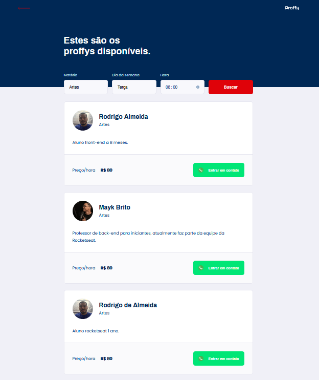
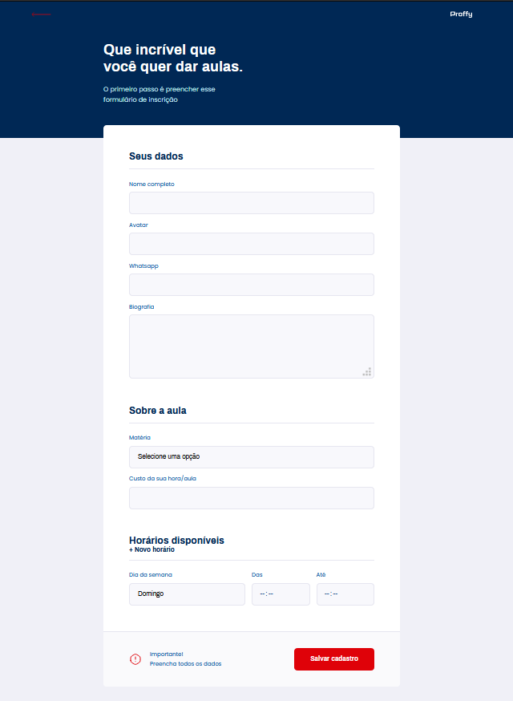

# 🚀 'Proffy' é um Projeto da [Rocketseat](https://rocketseat.com.br/) - 2º Next Level Week

## 📑 Descrição do projeto:

É uma plataforma voltada para estudos EAD, onde existem dois tipos de usuários,
alunos e professores. 
 
O professor pode se cadastrar listando as matérias das quais ele ministra, dias da semana, horários e disponíveis e o valor/hora das aulas.
 
Já o aluno pode procurar um professor pelos mesmos itens que o professor é cadastrado, além de poder favoritar os professores,
mantendo uma lista de favoritos.

 ---

## 🛠 Tecnologias utilizadas:
- React;
- React-native;
- TypeScript;
- Expo;
- Express;

 ---

 ## 💻 Telas da Aplicação Web:

  

  
  

 ## 📱 Telas da Aplicação Mobile:

  
  
  
  

